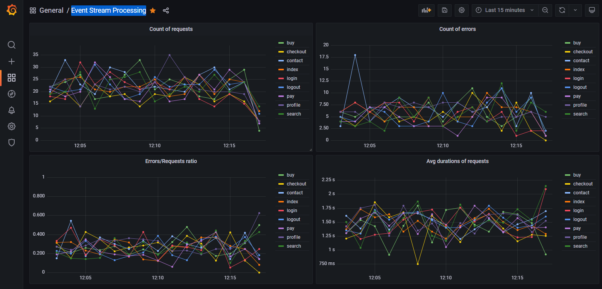

# Event stream processing
## Python + Kafka + Spark + PostgreSQL + Grafana

Application have tree parts:
* EventGenerator.py
  * This part generate fake data, then send them into kafka.
* Spark.py + EventReceiver.py
  * Spark.py read data and aggregate it and sent back to kafka on another topic.
  * EventReceiver.py read computed data from kafka and write it into Postgres.

## Run

Run commands from the project root directory.
### This run all services:
> docker-compose up -d --build

### Next run EventGenerator.py:
1. Log into docker event-generator CLI
2. Run: `export PYTHONPATH=$(pwd) && python -u ./app/EventGenerator.py  -m 100 -M 500`

### Finally we can visualise our data:
Enter into `http://localhost:3000/` and log with `admin/admin`, there will be dashboard "Event Stream Processing".

